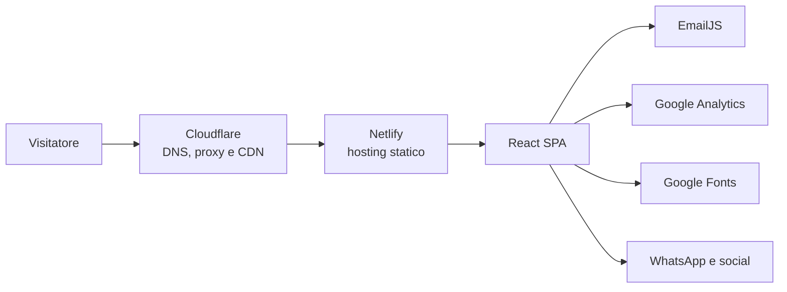
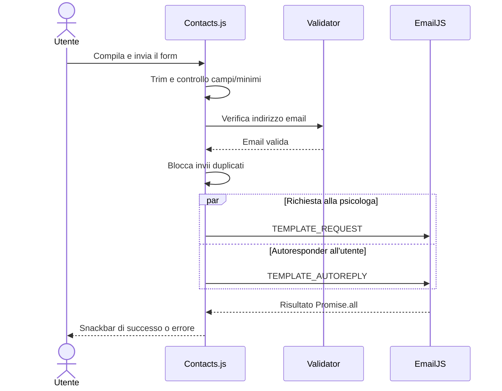

# Architettura del progetto

> Documento di riferimento per comprendere ed evolvere il portfolio della Dott.ssa Mariaelisabetta Albano.
>
> Stato analizzato: 16 luglio 2026.

## 1. Scopo del sistema

Il progetto è il sito professionale pubblico di una psicologa. L'applicazione presenta:

- identità e profilo professionale;
- servizi offerti;
- percorso formativo;
- recapiti e collegamenti social;
- modulo per richieste di appuntamento;
- privacy policy;
- metadati SEO, social e dati strutturati per i motori di ricerca.

Il prodotto è una **Single Page Application statica**: non esistono backend, database o API proprietarie. Il browser scarica HTML, CSS, JavaScript e asset generati da Vite. Le sole operazioni remote eseguite a runtime sono:

- invio del modulo tramite EmailJS;
- caricamento di Google Fonts;
- caricamento ed esecuzione di Google Analytics;
- navigazione verso servizi esterni come WhatsApp e social network.

## 2. Contesto e infrastruttura



La documentazione del repository indica:

| Responsabilità | Soluzione |
|---|---|
| Registrar del dominio | OVHcloud |
| DNS, proxy, CDN e protezione DDoS | Cloudflare |
| Hosting e deploy continuo | Netlify |
| Dominio pubblico | `https://psicologalbano.it` |
| URL canonici SEO | `https://www.psicologalbano.it` |
| Branch di produzione | `main` |

Il repository non contiene workflow CI, `netlify.toml` o altra configurazione Infrastructure as Code. Il collegamento Netlify-GitHub, il comando di build e le impostazioni del dominio sono quindi configurati esternamente al codice e devono essere verificati nel pannello Netlify.

## 3. Stack tecnologico

| Area | Tecnologia | Ruolo |
|---|---|---|
| UI | React 18 | Componenti e stato nel browser |
| Bootstrap DOM | `react-dom/client` | Mount tramite `createRoot` |
| Build e sviluppo | Vite 6 | Dev server, bundling e ottimizzazione |
| Routing | React Router DOM 6 | Routing client-side |
| Link interni | `@xzar90/react-router-hash-link` | Navigazione fluida verso sezioni della homepage |
| Component library | Material UI 6 | Drawer, button, snackbar, icone e primitive di stile |
| Styling MUI | Emotion | Implementazione di `styled` e `sx` |
| Animazioni | Framer Motion 12 | Entrata delle card e animazioni del menu |
| Icone | React Icons e MUI Icons | Iconografia delle sezioni e dei controlli |
| Head metadata | `react-helmet-async` | Titolo delle route attive |
| Form | Validator | Validazione email client-side |
| Email | EmailJS Browser SDK | Invio richiesta e autoresponder senza backend |
| Compressione build | `vite-plugin-compression` | Generazione degli asset `.gz` e `.br` |

Il codice è JavaScript con JSX, anche nei file `.js`. `vite.config.js` configura esplicitamente esbuild per interpretare come JSX sia `src/**/*.js` sia `src/**/*.jsx`.

## 4. Struttura del repository

```text
.
├── docs/
│   ├── ARCHITECTURE.md       # questo documento
│   ├── README.md             # guida generale, sviluppo e infrastruttura
│   └── ROADMAP.md            # evoluzioni previste
├── public/
│   ├── _redirects            # fallback SPA per Netlify
│   ├── favicon.ico
│   ├── favicon.png
│   ├── manifest.json
│   ├── og-image.png
│   ├── robots.txt
│   └── sitemap.xml
├── src/
│   ├── assets/
│   │   ├── fonts/
│   │   ├── svg/
│   │   └── webp/
│   ├── components/           # sezioni e componenti presentazionali
│   ├── contexts/
│   │   └── ThemeContext.js
│   ├── data/                 # contenuti e configurazioni editoriali
│   ├── pages/                # componenti associati alle route
│   ├── theme/                # palette e riferimenti agli asset del tema
│   ├── utils/                # utility React
│   ├── App.css
│   ├── App.js                # router principale
│   ├── index.css             # reset e regole globali
│   └── main.jsx              # entry point React
├── .env.example              # variabili EmailJS richieste
├── index.html                # shell HTML, SEO, JSON-LD e analytics
├── package.json
├── package-lock.json
└── vite.config.js
```

### Convenzioni strutturali

- Ogni componente complesso ha una directory dedicata con file JavaScript e CSS affiancati.
- I contenuti modificabili sono generalmente separati dalla UI e collocati in `src/data`.
- Le immagini importate dal codice sono in `src/assets` e vengono elaborate da Vite.
- I file da pubblicare senza trasformazioni sono in `public`.
- Non esiste un livello di servizi condiviso: l'unica integrazione applicativa, EmailJS, è implementata direttamente in `Contacts.js`.

## 5. Bootstrap dell'applicazione

Il flusso di inizializzazione è:

```text
index.html
└── src/main.jsx
    ├── HelmetProvider
    ├── ThemeContextProvider
    ├── MUI ThemeProvider
    └── App
        ├── BrowserRouter
        ├── ScrollToTop
        ├── Routes
        └── BackToTop
```

### `index.html`

È la shell statica servita per ogni route. Contiene:

- nodo `#root`;
- caricamento di `src/main.jsx`;
- metadati generali e canonical URL;
- Open Graph e Twitter Card;
- tre blocchi JSON-LD;
- preload dell'immagine principale;
- caricamento del font Poppins;
- snippet Google Analytics.

### `src/main.jsx`

Monta React e compone i provider globali:

1. `HelmetProvider`, necessario per `react-helmet-async`;
2. `ThemeContextProvider`, che espone la palette custom;
3. `ThemeProvider` di Material UI, inizializzato con il tema MUI predefinito;
4. `App`.

La palette applicativa e il tema MUI sono due sistemi distinti: il primo guida i colori del sito, mentre il secondo fornisce soprattutto breakpoint e comportamento dei componenti MUI.

## 6. Routing

Le route attive sono definite in `src/App.js`.

| Path | Pagina | Stato |
|---|---|---|
| `/` | `pages/Main/Main.js` | Attiva |
| `/info-legale` | `pages/InfoLegale/InfoLegale.js` | Attiva |
| Qualsiasi altro path | Redirect a `/` | Attivo |
| `/blog` | `pages/Blog/BlogPage.js` | Presente ma disabilitata |
| `/projects` | `pages/Project/ProjectPage.js` | Presente ma disabilitata |

Le pagine attive sono caricate con `React.lazy` e racchiuse in `Suspense`. Il fallback è uno scheletro neutro che occupa la viewport.

`public/_redirects` contiene:

```text
/*    /index.html  200
```

Questa regola è essenziale su Netlify: restituisce `index.html` anche quando una route viene aperta direttamente o ricaricata, lasciando la risoluzione del path a React Router.

`ScrollToTop` riporta la finestra all'inizio quando cambia il pathname. `BackToTop` è montato fuori dal router ma dentro l'albero dei provider e appare dopo 300 pixel di scroll.

## 7. Homepage e albero dei componenti

`pages/Main/Main.js` compone la homepage in quest'ordine:

```text
Main
├── Navbar
├── Landing
├── About       [lazy]
├── Services    [lazy]
├── Education   [lazy]
├── Contacts    [lazy]
└── Footer      [lazy]
```

`Navbar` e `Landing` sono inclusi nel chunk della pagina `Main`, caricato appena viene risolta la route `/`. Le sezioni successive sono divise in chunk caricati dinamicamente. Ogni sezione lazy ha un proprio `Suspense` per permettere un caricamento progressivo indipendente.

### Sezioni attive

| Sezione | ID/hash | Responsabilità | Sorgente contenuti |
|---|---|---|---|
| Navbar | Nessuno | Drawer di navigazione verso le sezioni | `headerData.js` e costante locale `NAV_ITEMS` |
| Landing | Inizio pagina | Hero, foto, citazione, social e CTA | `headerData.js`, `socialsData.js` |
| About | `#about` | Profilo professionale | `aboutData.js` |
| Services | `#services` | Griglia dei servizi | `servicesData.js` |
| Education | `#education` | Timeline/card della formazione | `educationData.js` |
| Contacts | `#contacts` | Form, recapiti e indirizzo | `contactsData.js`, variabili Vite |
| Footer | Nessuno | Dati professionali, sitemap, legale e social | `footerData.js`, `socialsData.js` |

La navigazione della homepage usa hash link come `/#services`. Gli ID delle sezioni sono quindi parte del contratto di navigazione e non devono essere rinominati senza aggiornare Navbar, Footer e ogni link esterno che li utilizza.

## 8. Modello dei contenuti

Non esiste un CMS. I contenuti sono moduli JavaScript versionati nel repository.

### File attivamente utilizzati

| File | Contenuto |
|---|---|
| `headerData.js` | Nome, qualifica, citazione e immagine hero |
| `aboutData.js` | Testo della sezione "Su di me" |
| `servicesData.js` | Elenco dei servizi e relative icone React |
| `educationData.js` | Formazione accademica e specializzazioni |
| `contactsData.js` | Telefono, WhatsApp, email, indirizzi e relativi link Google Maps |
| `socialsData.js` | URL social, email e PEC |
| `footerData.js` | Nome, partita IVA e iscrizione all'Albo |
| `privacyPolicyData.js` | Dati del titolare e data della privacy policy |
| `themeData.js` | Tema custom attivo |

### Caratteristiche del modello

- Gli elenchi usano ID stabili come chiavi React.
- `contactsData.addresses` modella sedi e disponibilità online come una lista di oggetti con ID, tipo, testo e link Google Maps opzionale.
- I campi facoltativi sono gestiti tramite controlli locali, ad esempio voto, tesi e partita IVA.
- Le icone dei servizi sono elementi JSX memorizzati direttamente nei dati; il file non è quindi JSON puro.
- Non esistono schemi, TypeScript, PropTypes o validazione automatica dei contenuti.

### Duplicazione dei dati pubblici

Nome, recapiti, indirizzi, servizi e profilo professionale compaiono in più sorgenti:

- `src/data/*`;
- testi JSX della privacy policy e del footer;
- meta tag e JSON-LD in `index.html`;
- `public/sitemap.xml`;
- `public/manifest.json`.

Ogni modifica a identità professionale, indirizzi, servizi, dominio o contatti richiede una ricerca globale per evitare divergenze tra contenuto visibile, SEO e dati legali.

## 9. Tema e styling

### Tema custom

La palette attiva è `purpleThemeLight`, definita in `src/theme/theme.js` e selezionata da `src/data/themeData.js`.

Le proprietà principali sono:

- `primary`: viola del brand;
- `secondary`: sfondo chiaro;
- `tertiary`: testo scuro;
- varianti alpha e tonalità intermedie;
- `contactsImg`: asset decorativo della sezione contatti.

`ThemeContextProvider` espone `{ theme }`. Il valore è inizializzato con `useState`, ma non esiste un setter né un selettore dark/light: il tema è attualmente statico.

### Strategie CSS

Lo styling è ibrido:

- CSS globale in `src/index.css` e `src/App.css`;
- fogli CSS affiancati ai componenti;
- stili inline basati sul tema;
- `sx` di Material UI;
- `styled` di Material UI/Emotion;
- colori hardcoded in alcuni CSS e nell'SVG decorativo.

`App.css` definisce `--primaryFont` come Poppins. `index.css` registra anche il font locale Bestermind, usato dal logo testuale nella Navbar.

I breakpoint ricorrenti sono:

- oltre `2560px`: monitor 2K/ultrawide;
- `992px-1380px`: laptop;
- sotto `992px`: tablet;
- sotto `800px` e `600px`: mobile;
- sotto `400px`: dispositivi molto stretti.

La responsività è gestita a livello di singolo foglio CSS, senza un file centralizzato di breakpoint o token.

## 10. Animazioni e interazioni

Framer Motion è usato per:

- apertura progressiva degli elementi del drawer;
- entrata dal basso delle card di servizi e formazione;
- hover e scaling di controlli e card.

Altre animazioni sono CSS:

- frecce di scroll nella hero;
- movimento dell'icona dei servizi;
- stato di invio del form.

Le animazioni `whileInView` sono configurate con `viewport.once = true`, quindi vengono eseguite solo la prima volta che l'elemento entra nel viewport.

## 11. Flusso del modulo contatti

Il modulo è completamente client-side e vive in `src/components/Contacts/Contacts.js`.



### Variabili richieste

```dotenv
VITE_EMAILJS_SERVICE_ID=
VITE_EMAILJS_TEMPLATE_REQUEST=
VITE_EMAILJS_TEMPLATE_AUTOREPLY=
VITE_EMAILJS_PUBLIC_KEY=
```

Sono documentate in `.env.example`. In Vite, tutte le variabili con prefisso `VITE_` vengono incorporate nel bundle e sono leggibili dal browser. La public key EmailJS non deve essere trattata come un segreto server-side; protezione antiabuso, limiti, template e domini consentiti devono essere configurati sul servizio EmailJS.

### Validazione

Prima dell'invio vengono verificati:

- presenza di tutti i campi;
- nome di almeno 3 caratteri;
- oggetto di almeno 5 caratteri;
- messaggio di almeno 10 caratteri;
- email formalmente valida.

Un ref sincrono e lo stato `isSubmitting` impediscono doppi invii durante una richiesta. Non sono presenti CAPTCHA, rate limiting applicativo o validazione server proprietaria.

I due messaggi EmailJS sono inviati in parallelo con `Promise.all`. Non esiste atomicità: uno dei due invii può completarsi anche se l'altro fallisce e l'interfaccia mostra un errore complessivo.

## 12. SEO, indicizzazione e analytics

### SEO statica

La maggior parte della SEO è definita in `index.html`, quindi è disponibile già nella risposta HTML:

- title e description;
- keyword e metadati geografici;
- canonical;
- Open Graph;
- Twitter Card;
- lingua italiana;
- preload dell'immagine LCP.

Le route React attive impostano il titolo con `react-helmet-async`, ma non ridefiniscono canonical, description o social metadata per route. La pagina `/info-legale` eredita quindi i metadati generali della homepage salvo il titolo.

### Dati strutturati

`index.html` contiene:

1. un grafo `Person`, `LocalBusiness` e collaborazioni;
2. `WebSite` con `SearchAction`;
3. `FAQPage`.

Le FAQ sono attualmente presenti solo nel JSON-LD e non come sezione React visibile. La roadmap identifica esplicitamente la futura aggiunta di una sezione FAQ on-page.

### File per crawler

- `public/robots.txt` consente la scansione e dichiara la sitemap;
- `public/sitemap.xml` contiene homepage e pagina legale;
- `public/og-image.png` è l'immagine social;
- `public/manifest.json` fornisce metadati installabili di base.

Quando viene aggiunta una route pubblica indicizzabile, occorre aggiornare almeno routing, sitemap, canonical/meta specifici ed eventuali link interni.

### Google Analytics

Google Analytics è caricato direttamente in `index.html` con measurement ID `G-VB2PFVSKQM`.

La privacy policy dichiara l'uso di Google Analytics e dei relativi cookie. Rimane una criticità tecnica: lo script viene caricato immediatamente da `index.html`, senza un meccanismo che raccolga il consenso e blocchi Analytics prima dell'accettazione.

## 13. Asset e performance

### Asset

- Le immagini principali sono WebP per contenere il peso.
- Le icone decorative locali sono SVG.
- Il font calligrafico è locale in formato WOFF2.
- Poppins è caricato da Google Fonts.
- favicon, manifest, sitemap e immagine Open Graph sono asset pubblici non trasformati.

### Ottimizzazioni presenti

- route e sezioni secondarie caricate con `React.lazy`;
- immagini non-LCP con `loading="lazy"` e `decoding="async"` in alcune sezioni;
- preload dell'immagine hero;
- font locale con `font-display: swap`;
- chunk manuali per React, MUI e Framer Motion;
- CSS code splitting;
- minificazione esbuild;
- output gzip e Brotli per file oltre 1 KB;
- sourcemap disabilitate in produzione.

### Configurazione build

`vite.config.js` produce la cartella `build` e divide i vendor in:

- `vendor-react`;
- `vendor-mui`;
- `vendor-motion`.

Il target è `esnext`. La build privilegia browser moderni; la sezione `browserslist` di `package.json` non sostituisce il target esplicito configurato in Vite.

Gli asset precompressi sono utili solo se Netlify/Cloudflare li servono correttamente in base all'header `Accept-Encoding`. La loro generazione non garantisce da sola che vengano utilizzati.

## 14. Codice presente ma non attivo

Il repository deriva da un template portfolio più generico e conserva moduli non montati nell'applicazione corrente:

- `Achievement`;
- `Blog` e `BlogPage`;
- `Experience`;
- `Projects` e `ProjectPage`;
- i rispettivi file CSS e data file;
- `skillsData.js`.

I data file legacy contengono ancora contenuti dimostrativi estranei al portfolio della psicologa. Non devono essere considerati contenuto pubblicabile.

Le route Blog e Projects sono commentate in `App.js`; i componenti non sono inclusi nella homepage. Alcuni moduli legacy importano `@mui/styles`, che non è dichiarato nelle dipendenze di `package.json`. Riattivarli richiede quindi una revisione funzionale, editoriale e delle dipendenze, non la sola rimozione dei commenti.

`src/components/index.js` e `src/pages/index.js` esportano anche componenti inattivi. Il percorso attivo preferisce prevalentemente import diretti.

## 15. Qualità, test e osservabilità

### Test

Non esiste un test runner configurato. Lo script:

```json
"test": "echo \"No test runner configured\" && exit 0"
```

termina con successo senza eseguire test. Le dipendenze Testing Library sono installate ma non sono presenti file di test.

### Lint e type safety

- Non esiste uno script `lint`.
- È presente una configurazione ESLint ereditata da Create React App, ma non è presente una toolchain ESLint eseguibile nel progetto.
- Non sono usati TypeScript, PropTypes o schemi runtime.

### Errori runtime

- Gli errori EmailJS sono mostrati all'utente con Snackbar.
- Le variabili EmailJS mancanti producono un `console.error` all'import del modulo.
- Non sono presenti error boundary React.
- Non sono presenti logging applicativo o error tracking dedicato.
- Google Analytics è l'unico strumento di osservabilità configurato.

## 16. Debito tecnico e vincoli noti

Questi punti sono importanti per pianificare modifiche future:

1. **Contenuti duplicati:** SEO, dati legali e contenuti UI possono divergere perché non condividono una sorgente unica.
2. **Consenso Analytics non implementato:** l'informativa descrive Google Analytics, ma lo script viene caricato prima di un consenso esplicito e non è presente un meccanismo di revoca.
3. **Tema non unificato:** palette custom, tema MUI e colori hardcoded convivono.
4. **Tema statico:** `ThemeContext` non supporta cambio tema nonostante la struttura derivi da un sistema light/dark.
5. **Codice legacy:** moduli inattivi e dati demo aumentano il rumore e possono essere riattivati accidentalmente.
6. **Nessuna copertura automatica:** build e comportamento del form non sono protetti da test.
7. **Integrazione form solo client-side:** sicurezza e affidabilità dipendono da EmailJS.
8. **SEO per-route limitata:** le route condividono quasi tutti i metadati della homepage.
9. **Configurazione deploy esterna:** parte dell'architettura operativa non è versionata.
10. **Listener di scroll:** `BackToTop` registra il listener direttamente durante il render e non lo rimuove; future modifiche dovrebbero spostarlo in un effect con cleanup.
11. **Target browser moderno:** `build.target = "esnext"` riduce la compatibilità con browser datati.
12. **Dati strutturati manuali:** JSON-LD e contenuto visibile possono descrivere servizi o sedi differenti se aggiornati separatamente.
13. **Ricerca dichiarata ma assente:** il JSON-LD espone una `SearchAction` verso `?q=...`, ma l'applicazione non implementa alcuna ricerca globale né interpreta quel parametro.

## 17. Linee guida per le evoluzioni

### Modificare contenuti esistenti

1. Aggiornare il file pertinente in `src/data`.
2. Cercare lo stesso dato in `index.html`, privacy policy, footer, manifest e sitemap.
3. Verificare link `tel:`, `mailto:`, WhatsApp e profili social.
4. Eseguire la build di produzione.

### Aggiungere una sezione alla homepage

1. Creare `src/components/<Nome>/<Nome>.js` e il CSS affiancato.
2. Spostare i contenuti editoriali in `src/data/<nome>Data.js`.
3. Montare la sezione in `pages/Main/Main.js`, preferibilmente con lazy loading se non è above-the-fold.
4. Assegnare un ID stabile.
5. Aggiornare Navbar e Footer se la sezione deve essere navigabile.
6. Aggiornare SEO/JSON-LD se introduce informazioni indicizzabili.

### Aggiungere una route pubblica

1. Creare la pagina sotto `src/pages`.
2. Aggiungere lazy import e `Route` in `App.js`.
3. Definire title, description, canonical e social metadata specifici.
4. Aggiungere la route alla sitemap.
5. Collegarla dalla UI.
6. Verificare l'apertura diretta della route tramite fallback Netlify.

### Evolvere il form

Per semplici modifiche ai template è sufficiente mantenere EmailJS. Per allegati, dati sensibili, audit, rate limiting forte, persistenza o logica transazionale è opportuno introdurre una funzione serverless o un backend, evitando di spostare segreti nel bundle Vite.

### Riattivare Blog, Projects o Experience

Prima della riattivazione:

1. sostituire tutti i dati demo;
2. rimuovere o installare consapevolmente le dipendenze legacy;
3. migrare `react-helmet` a `react-helmet-async`;
4. verificare design e lingua;
5. aggiungere metadata e sitemap;
6. introdurre test almeno per routing e rendering.

## 18. Comandi operativi

```bash
npm install
npm run dev       # dev server su http://localhost:8080
npm run build     # output in build/
npm run preview   # preview locale della build
npm test          # attualmente non esegue test reali
```

Requisito documentato: Node.js 18 o superiore.

## 19. Fonti di verità

Per evitare assunzioni nelle future interazioni:

| Informazione | Fonte primaria |
|---|---|
| Route attive | `src/App.js` |
| Composizione homepage | `src/pages/Main/Main.js` |
| Contenuti visibili | `src/data/*` e componenti attivi |
| Palette | `src/theme/theme.js` e `src/data/themeData.js` |
| Variabili EmailJS | `.env.example` e `Contacts.js` |
| SEO e JSON-LD | `index.html` |
| Indicizzazione | `public/robots.txt`, `public/sitemap.xml` |
| Fallback hosting SPA | `public/_redirects` |
| Build e chunking | `vite.config.js` |
| Dipendenze e script | `package.json` |
| Hosting e dominio | `docs/README.md` più configurazione esterna Netlify/Cloudflare |
| Evoluzioni pianificate | `docs/ROADMAP.md` |

Questo documento descrive l'architettura osservata nel repository alla data indicata. In caso di conflitto, il codice eseguibile e la configurazione effettiva dei provider esterni prevalgono sulla documentazione.
